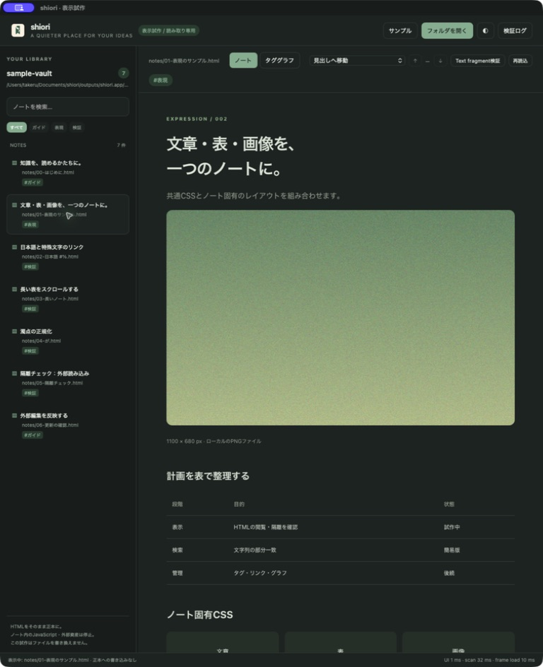
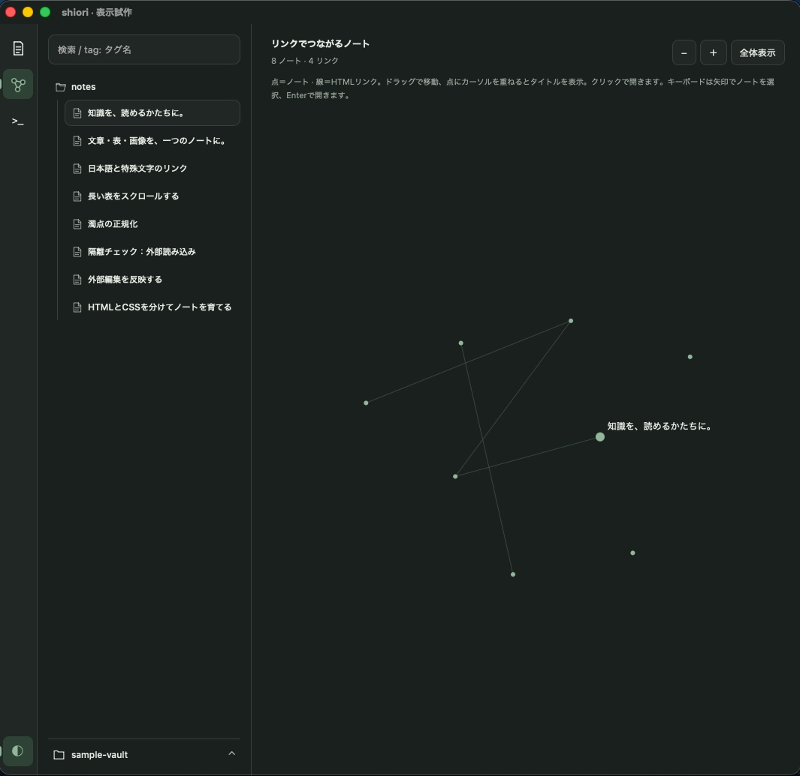

<p align="center">
  
</p>

# shiori

[](https://tauri.app/)
[](src-tauri/Cargo.toml)
[](ui/app.js)
[](ui/index.html)
[](ui/app.css)
[](#supported-operating-systems)
[](#limitations-and-security-model)

A local HTML knowledge library. Let an AI assistant write and update your notes, read them in shiori, and keep their history in Git.

Your vault is a folder of ordinary HTML, CSS, and images. HTML files remain the source of truth: shiori reads them without rewriting the originals, preserving the layouts, tables, and illustrations that make each note useful.

**Status:** early desktop prototype for macOS, with HTML reading, per-note tag editing, folder creation/renaming and note moves, and an integrated terminal. The interface and bundled sample notes are currently in Japanese.

## Screenshots

Earlier macOS prototype showing the bundled sample vault in dark mode. These screenshots predate the simplified sidebar and multi-pane reader; updated captures are pending native UI verification.

| Read HTML notes | Explore shared tags |
| --- | --- |
|  |  |

## Features

- Open a local vault and browse notes by title, text, or tag.
- Read HTML with local images, tables, shared CSS, and note-specific styles.
- Compare notes in two side-by-side panes, each with its own tabs and document search.
- Move between highlighted matches independently in each tab.
- Explore a graph connecting notes to their tags. Select a tag to filter or a note to read it.
- Browse notes grouped by folder and hover over a note title to see its path. Tags appear below each reader pane’s tab bar; tag names filter the sidebar without leaving the reader. Use × or ＋ to prepare a tag edit.
- Switch between light and dark themes and resize the sidebar.
- Reload the entire vault from the button beside its name, or apply an external-change notification.
- Expand the sidebar’s read-error details to see which files could not be loaded and why.

Use the square icon buttons in the left navigation rail to switch between notes and the tag graph. Returning from a note preserves the graph page, zoom, and pan. Changing the search or tag filter, opening a vault, or refreshing its contents resets graph exploration; switching pages resets zoom and pan. A note excluded by the active filters remains identified in a compact sidebar section.

The graph displays up to 150 notes per page, follows the current search and tag filter, and supports zoom, pan, and keyboard selection. Its edges represent tag membership; hierarchical tag names use exact matching, and HTML links do not create graph edges.

## Search by text and tag

Type a phrase to search note titles and body text. Add `tag:` clauses to filter by existing tags:

| Query | Meaning |
| --- | --- |
| `tag: 開発/IT` | Notes with exactly the tag `開発/IT` |
| `ownership tag: Rust` | The text `ownership` and the tag `Rust` |
| `tag: Rust tag: 学習` | Notes containing both tags (AND) |
| `tag: "machine learning"` | A tag whose name contains spaces |

Tags use case-sensitive exact matching: `tag: 開発` does not include `開発/IT`. Free text remains a single case-insensitive substring search. When opening a note from the list or graph, only free text is copied into that tab’s document search. Changing the sidebar search does not change already-open tabs.

Type `tag:` to see up to eight matching tag suggestions. Use ↑/↓ and Enter to insert a suggestion, Escape to dismiss, or click a candidate. Enter with no candidate selected opens the first matching note. Quoted tag names support JSON escapes such as `\"` and `\\`; names beginning with `tag:` must also be quoted. Empty clauses and unclosed quotes are ignored until completed; a complete but unknown tag returns no matches. IME composition is applied after confirmation.

The search field is the source of filter state. Selecting a tag in the graph or a reader pane's tag-name button replaces the tag clauses with that tag while preserving free text. Remove the `tag:` clause to clear its filter.

## Read with panes and tabs

Each pane shows the tags of its selected tab below the tab bar, or **タグなし** for an untagged note. Empty tabs have no tag row. Many tags wrap within a bounded, scrollable row. The sidebar groups note titles by folder and includes a reminder for a current note outside the filter; discover tags through `tag:` suggestions or the graph. Use **×** beside a tag to prepare its removal, or **＋** to open the tag editor. Existing tags are suggested as you type; choose **追加** (Add) to add the input to the draft, then **保存** (Save) to write the changes. **取消** (Cancel) or Escape discards the draft. Tag-name clicks only filter and never write a file. Use the navigation rail to open the graph.

Edits change only `meta[name="note-tag"]` elements in an explicit HTML head. Other source bytes are retained. Supported notes are UTF-8, at most 16 MiB, with unambiguous head markup; malformed or unsupported head structures, read-only files, and symlink targets are rejected. A note can have up to 128 exact, case-sensitive tags, each at most 256 UTF-8 bytes without control characters. Empty or whitespace-only tags are rejected; duplicate values are removed.

Save checks the original source hash and refuses external changes. On conflict, cancel, reload the vault, and review the newer note before editing again. Successful saves update both panes, search candidates, and graph data while preserving tabs and queries. Edited notes and any other notes whose source hash changed reload, resetting their scroll/match position; unchanged iframes remain attached. Scan errors after a write are reported as **saved**, with details in the sidebar. A final hash check and atomic replacement cannot eliminate the small race with unrelated external editors; see the [tag editing contract](docs/TAG_EDITING.md).

The active pane has an accented top border. Opening a note from the sidebar or graph normally replaces its active tab. Click inside a pane or move focus into it with Tab to make it active. An empty pane itself is focusable; select it, then choose a note from the sidebar.

| Action | How |
| --- | --- |
| Open a new tab | ⌘/Ctrl-click a list item or graph note |
| Open beside the current note | Use the **pane +** icon to duplicate the current note into a second pane, or Shift-click a list item or graph note |
| Switch or close a tab | Select its title or use its × button |
| Search one document | Enter a phrase in the always-visible document search row and press Enter |
| Follow an internal link | Click it in the note to navigate within that same tab |
| Move focus between panes | Click in the destination pane or use Tab to focus its controls |
| Resize panes | Drag the divider; double-click to restore equal widths. With the divider focused, use ←/→ for 5% steps, Home for minimum left width, or End for equal widths |
| Remove a pane | Use the **pane −** icon; its tabs close too. Disabled when only one pane remains |

At most two panes are available. Adding a pane is disabled while split. If the left pane was removed, adding an adjacent pane fills the vacant left side without moving the surviving document.

Tab switches keep the existing sandboxed iframe attached, preserving its document scroll and search state. With focus on a tab title, use ←/→ or Home/End to switch tabs and Delete to close one. The buttons are reachable by Tab. Keyboard events inside the sandboxed note do not reach the app: move focus back to the app controls to use tab commands. Modifier-click handling inside note HTML is not available. To open another note in a new tab or beside the current note, use ⌘/Ctrl-click or Shift-click respectively on its sidebar list entry or graph node.

This first version supports two horizontal panes and up to 12 tabs in one vault. Each pane stays at least 320 px wide; narrow windows scroll the reader workspace horizontally instead of silently closing a pane. The tag graph remains a whole-workspace mode and preserves the open reader tabs when switching back.

Reloading the vault restores surviving tabs, their selected pane/tab, and their search phrases. Tabs whose paths were deleted or renamed close; an empty pane stays available for another note. Reload and theme changes regenerate the documents and reset scroll positions and the current search match. The split ratio is retained when closing and reopening a pane in the same vault. Narrow windows temporarily clamp the widths to the 320 px minimum; the preferred ratio returns when space is available. Pane widths reset to equal on vault switches and app restarts; pane/tab state is not saved.

## Folders and moving notes

The sidebar starts at `notes/`; vault-root files and unrelated directories are not listed. Existing folders below `notes/`, including empty folders, appear in an indented tree with hierarchy guide lines and short folder names. Collapsing a folder hides its entire subtree. Search and tag filters retain matching folders and their ancestors and temporarily expand them. Clearing filters restores the collapsed state.

Use the **folder-plus icon** on a folder row to create a child folder. Right-click a folder (secondary click on a trackpad) and choose **名称変更** to rename it directly in its row. Press Enter to save or Escape to cancel. Keyboard users can open the folder menu with Shift+F10 or the Context Menu key. The `notes/` root cannot be renamed. Creating the first folder in an empty vault initializes `notes/`.

Drag a note title onto a folder heading to move it there directly, including a folder just created in shiori. There is no per-file move button or destination modal. For keyboard access, focus a note and press Space, Tab to the destination folder, and press Enter; Escape cancels the selection.

Moves retain the filename, original bytes, and note ID. Existing destination names are never overwritten. The backend checks the active vault, source hash, revision, and destination before renaming; stale state, excluded paths, symbolic links, and unsupported cross-filesystem moves are rejected. Folder renames preserve the contents and update open tabs for every descendant note.

A file drop triggers static reference analysis and then the move. If links may change, a brief status message appears; no persistent reference report occupies the sidebar. No automatic link repair is performed, including during folder renames. Analysis covers common HTML URLs, srcset candidates, and embedded CSS URLs/imports, but is bounded and does not fully index dynamic references or references outside scanned HTML notes.

Open tabs follow the new paths and retain their queries. Moved documents reload, resetting scroll and current search-match position. Folder groups, tag suggestions, and graph data update from the returned snapshot. Scan failures after a successful operation are reported as completed. Finder drag/drop, moving across filesystems, and automatic link repair remain outside this feature. Final validation does not lock out unrelated external filesystem changes.

## Workflow: AI writes, shiori reads, Git keeps history

1. Choose a vault folder, separate from the application source.
2. Give your AI assistant the path to the bundled [shiori-notes Skill](skills/shiori-notes/SKILL.md) and the target vault.
3. For structured explanations and shared document styling, also provide [shiori-readable-notes](skills/shiori-readable-notes/SKILL.md). Ask it to create or update HTML notes. The Skill describes existing-tag reuse, generated UUIDs, stable heading IDs, relative links, and local assets.
4. Open the folder in shiori, or apply the external-change notification to read the updated files.
5. Review the changes and commit or sync the vault using your usual Git tools.

Example prompt, from the application repository:

```text
Read skills/shiori-notes/SKILL.md and skills/shiori-readable-notes/SKILL.md.
Follow them to create a note about Rust ownership in ../vault. Check related notes and existing tags first, reuse
relevant tags, and link to existing notes where useful. Write the note in English.
```

These Skills are included as files; they are not automatically installed into an AI tool. Use an assistant that can read the Skill and edit files in your chosen vault. The viewer does not edit notes. The integrated terminal runs your shell; you choose whether to start Codex, Claude, Git, or other installed tools. Those commands may edit files or contact external services. Commit and push are separate actions you request from your tools.

The readability Skill includes a [starter HTML file](skills/shiori-readable-notes/assets/note.html) and [shared CSS](skills/shiori-readable-notes/assets/shiori-document.css) to copy into the vault. It uses OS fonts, static SVG, plain code, and explicit light/dark theme hooks without scripts or remote dependencies. The [eighth sample note](sample-vault/notes/07-readable-notes.html) demonstrates the style. Editorial sources and reuse decisions are documented in [sources.md](skills/shiori-readable-notes/references/sources.md).

A vault can be its own Git repository. For example, after creating a new vault:

```sh
git -C ../vault init
git -C ../vault status
git -C ../vault diff
# Stage the note and asset files you have reviewed, then commit them.
```

Configure a remote and push with your Git client when you want to sync. The vault repository is independent of this app repository; no submodule is required.

## Integrated terminal

Select **>_** in the left rail to open an interactive shell inside shiori. Run `codex`, `claude`, or any other installed command yourself. There is no selected-note prompt, model picker, or tool-specific execution mode. The native PTY and locally bundled xterm.js support terminal input, ANSI output, Ctrl-C, and resizing.

The shell starts in a vault-specific workspace under the app data directory's `terminal-workspaces/`. It contains `skills/`, `.claude/skills/`, `AGENTS.md`, and `CLAUDE.md`; the two instruction files name the currently selected vault as the default destination for HTML notes and point to the bundled authoring Skills. The workspace is distinct from the vault, so app helper files do not enter your notes repository. Claude discovers the project Skills under `.claude/skills/`; use `/shiori-readable-notes` or `/shiori-notes`. Reopen the shell after updating shiori to refresh these files, and restart Claude if its command list has not refreshed. The shell also receives:

| Variable | Value |
| --- | --- |
| `SHIORI_VAULT` | Absolute path of the current vault |
| `SHIORI_SKILLS` | Absolute path of the workspace's Skills directory |

For example, after starting an AI tool, ask it to “Create an HTML note about this topic in the configured vault using the provided Skills.” Tools that read [AGENTS.md](https://developers.openai.com/codex/guides/agents-md) or [CLAUDE.md](https://code.claude.com/docs/en/memory) can obtain the destination from those instructions. This is a default instruction, not a forced output redirection: arbitrary commands use their own paths, and tool sandbox/trust settings may require explicitly allowing access to the vault. The app does not automatically launch an AI tool or bypass its approvals.

The user's default shell starts with its normal environment/login setup. Install and authenticate tools as usual. Hiding the panel preserves the shell; the **ⓘ** popover shows the full, copyable HTML destination and working directory. To end the shell, run `exit` at its prompt. After the shell exits or startup fails, use **シェルを再起動** in the terminal area to start a new session. Escape or an outside click dismisses the popover. Close the shell before switching vaults, then reopen it to receive the new destination. A normal vault refresh stays available while the terminal is open, and external edits trigger **更新を反映** without an automatic scroll reset.

The terminal runs with your user privileges and can execute arbitrary commands; its cwd is not a filesystem sandbox. The reader iframe remains isolated from terminal IPC. On Unix, closing a session or quitting the app terminates the shell and foreground process group; intentionally detached jobs may survive, as in other terminals. Scrollback is limited to 2,000 lines and output delivery waits for renderer acknowledgements. shiori does not save terminal transcripts; shell history and CLI logs follow those tools' settings. Generated workspace files persist and are refreshed when opening a session; keep notes in the vault. Native operation is currently verified only through macOS PTY tests, with graphical TUI checks still pending.

## Supported operating systems

| Platform | Current status |
| --- | --- |
| macOS / Apple Silicon | Current development and manual testing platform |
| macOS / Intel | Not yet validated; no verified build provided |
| Windows / Linux | Not currently supported or tested by this project |

The macOS bundle declares macOS 12.0 as its minimum version; compatibility across all versions from 12.0 onward has not been verified. Tauri's platform support does not imply that shiori has been tested on those platforms.

## Build and run

### Prerequisites

- macOS with Xcode Command Line Tools (`xcode-select --install`). See the [official Tauri prerequisites](https://v2.tauri.app/start/prerequisites/#macos).
- Rust stable and Cargo available on your `PATH`.
- Git to clone the repository.
- Python 3 to assemble the `.app` bundle.
- Node.js with `node --test` support for JavaScript tests only.

There is no npm install step, frontend bundler, or Tauri CLI requirement. Rust and Node.js are not needed to launch an already-built app.

### Get the source

This layout keeps build outputs and your personal vault outside the source repository:

```sh
mkdir shiori-workspace
cd shiori-workspace
git clone https://github.com/azpiero/shiori.git app
cd app
```

### Run from source

```sh
cargo run --locked --manifest-path src-tauri/Cargo.toml --features custom-protocol
```

On first launch, the app opens eight bundled sample notes. Subsequent launches restore the last folder you selected. Use the folder icon next to reload in the sidebar (**フォルダを開く** / Open folder) to open your vault, the graph icon in the left navigation rail to explore tags, and **更新を反映** (Apply updates) after editing notes externally. To return to the samples, open `sample-vault/` through the folder picker. The theme toggle sits at the bottom of the left navigation rail; there is no app header above the workspace.

The canonical vault path is stored as `last_vault` in `settings.json` under Tauri's app configuration directory (on macOS, `~/Library/Application Support/dev.takeru.shiori/`). Vault tokens and reader tabs are not stored. If the saved folder is unavailable or settings cannot be read, the app opens the samples and displays the reason in the sidebar. The saved path is retained so a temporarily disconnected volume can be restored on a later launch. Selecting another folder replaces it; a settings write failure is shown without preventing the folder from opening. To reset the remembered folder, quit the app and remove `settings.json`. Theme preferences remain in local storage.

The status bar identifies body reading and explicit tag editing, including while loading or showing errors. The development diagnostics panel and log collection have been removed; failed note reads are listed under **読み取りエラー** (Read errors) in the sidebar. The status bar retains basic load timings.

### Build a macOS app bundle

```sh
./scripts/build-macos.sh
open ../outputs/shiori.app
```

The script builds a development binary for the host architecture, copies the sample vault and icon, and applies and verifies an ad-hoc signature. It produces `../outputs/shiori.app`; this is not a notarized release package. Close the running app and reopen it after rebuilding.

By default, the script stores build artifacts in `../work/target`. Set `CARGO_TARGET_DIR` to override that location. Its fallback to `../work/toolchain` is for the maintainer's local setup; a normal installation with Cargo on `PATH` does not need that directory.

### Tests

Run from `app/`:

```sh
cargo test --locked --manifest-path src-tauri/Cargo.toml --features custom-protocol
node --test tests/*.test.cjs
node --check ui/app.js
node --check ui/graph.js
node --check ui/search.js
node --check ui/workspace.js
node --check ui/reader.js
```

The Rust suite covers vault boundaries, HTML sanitization, and preservation of source files. JavaScript tests cover tag syntax and suggestions, tag membership, graph pagination, pane routing, tab lifetime, and navigation/search state using a small DOM/Tauri adapter. They do not verify native WebView rendering or layout. The performance benchmark is an opt-in ignored Rust test; see [performance measurements and reproduction steps](docs/PERFORMANCE.md).

## Technology stack

| Layer | Technology |
| --- | --- |
| Desktop shell | Tauri 2 with a Rust backend |
| macOS rendering | System WKWebView, with a sandboxed iframe for notes |
| Interface | Plain HTML, CSS, and JavaScript; SVG for the tag graph |
| HTML processing | `kuchiki` for parsing and display-copy transformation |
| Files and metadata | `walkdir`, `serde`, `serde_json`, URL and Unicode utilities |
| Storage | Local HTML files and assets; extracted text held in memory |
| Version control | External Git tools for the app and, optionally, a separate vault repository |

Dependency versions are pinned in [Cargo.lock](src-tauri/Cargo.lock). SQLite, persistent caches, and FTS5 are not implemented; their use is being evaluated in [#1](https://github.com/azpiero/shiori/issues/1).

## Directory structure

Suggested workspace layout; your vault can live elsewhere:

```text
shiori-workspace/
├── app/                    # This Git repository
│   ├── ui/                 # HTML/CSS/JavaScript interface and graph
│   ├── src-tauri/          # Rust backend, Tauri config, icons, Cargo.lock
│   ├── skills/
│   │   ├── shiori-notes/   # Vault metadata and file conventions
│   │   └── shiori-readable-notes/ # Writing guidance, CSS, and HTML template
│   ├── sample-vault/       # Eight demonstration and test notes
│   ├── fixtures/           # Test assets, including vault-boundary fixtures
│   ├── tests/              # JavaScript graph tests
│   ├── scripts/            # macOS packaging and benchmark tools
│   └── docs/               # Requirements, verification, performance, images
├── vault/                  # Your notes; optionally a separate Git repository
│   ├── notes/              # UTF-8 .html files
│   ├── assets/             # Images and other local assets
│   └── styles/             # Shared CSS
├── outputs/                # Generated shiori.app
└── work/                   # Build cache and disposable benchmark data
```

The `notes/`, `assets/`, and `styles/` layout is the Skill's default for a new vault. Keep existing vault conventions when editing an established collection. `.git`, `node_modules`, `.shiori`, and `.html-vault` directories are excluded from scans; HTML under root-level `assets/` and `styles/` is not treated as notes.

## Limitations and security model

The reader can add and remove tags through an explicit save and move notes between folders by dragging, but does not edit body content. Commands in the terminal can edit source files. Global tag renaming, automatic link repair, navigation history, and Git synchronization are not implemented.

Notes are served through a vault-scoped protocol after resolving paths and symlinks. A sandboxed iframe, Content Security Policy, and display-copy sanitization restrict scripts, forms, frames, and external resources. Original HTML remains unchanged. External links are currently disabled.

These controls have backend tests, but full verification of external-communication and IPC blocking in the real WebView remains open in [#3](https://github.com/azpiero/shiori/issues/3).

Other current limits:

- Notes must be UTF-8 files with a lowercase `.html` extension. The file-size limit is 16 MiB.
- Search uses one substring, without multi-term AND or regular expressions. List filtering ignores case; highlighting is case-sensitive and does not span HTML text nodes. At most 1,000 matches are marked per note.
- Opening or refreshing a vault reparses all notes. Large vaults can be slow; see [#1](https://github.com/azpiero/shiori/issues/1).
- Applying external changes or changing the theme resets document scroll positions in all open tabs.
- Theme switching does not force arbitrary user HTML to adopt the app's colors.

## Contributing and roadmap

Bug reports and focused pull requests are welcome. Check [existing issues](https://github.com/azpiero/shiori/issues) before opening a new one. For bugs, include your macOS version, CPU architecture, reproduction steps, expected and actual behavior, and a small sample note when relevant. Use synthetic examples instead of private vault contents.

For code changes, describe the user-visible behavior, run the relevant tests above, and record manual UI checks when changing rendering or interaction. Discuss substantial architecture changes in an issue first.

Current work includes [large-vault performance](https://github.com/azpiero/shiori/issues/1), [WebView isolation verification](https://github.com/azpiero/shiori/issues/3), [interaction testing](https://github.com/azpiero/shiori/issues/4), [navigation history](https://github.com/azpiero/shiori/issues/5), and [Skill workflow validation](https://github.com/azpiero/shiori/issues/6).

## Documentation

Detailed working documents are currently in Japanese:

- [Requirements and design decisions](docs/requirements.md)
- [Verification records](docs/VERIFICATION.md)
- [Performance measurements](docs/PERFORMANCE.md)
- [AI note-authoring Skill](skills/shiori-notes/SKILL.md)

## License

A project license has not yet been selected. This repository currently does not include a `LICENSE` file.
